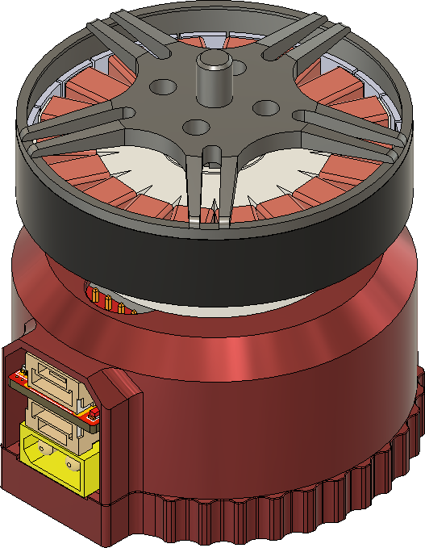

# Zubax Sadulli

## Overview

Sadulli is a 500 W integrated drive for unmanned aerial applications that contains a motor and its control electronics in a compact enclosure. 

The main design goal is to create a compact yet sophisticated motor controller that can be used with relatively small BLDC motors (about 40-45 mm in diameter) and can form an integrated drive together with the motor. This integrated drive should be possible to use as a direct replacement for just a motor alone without any major modifications to the aircraft it is used on. 

## Brief specs

- Operating voltage range 4-8S Li-Po (LiCoO2) battery (15-34 V)
- Maximum continuous power 500 W
- [UAVCAN hardware recommendations](https://uavcan.org/Specification/8._Hardware_design_recommendations/) following
- Absence of necessity to invoke soldering to setup the device

Sadulli consists of two main parts:  COTS motor and the ESC.  This repository contains the ESC hardware source files only.  There are three design variants of the Sadulli drive. All of them share the same ESC design.

| Variant | Motor                                                        | Propeller diameter (inch) | Propeller pitch (inch) | Optimum thrust (kg) | Max thrust (kg) | Mass (g) |
| ------- | ------------------------------------------------------------ | ------------------------- | ---------------------- | ------------------- | --------------- | -------- |
| Grosso  | [V4014](http://en.rcsunnysky.com/v-multi-rotorefficiencytype/1083.html) | 17                        | 6.2                    | 1.5                 | 4               | 207      |
| Piccino | [V4006](http://en.rcsunnysky.com/v-multi-rotorefficiencytype/1081.html) | 15                        | 5.5                    | 0.7                 | 1.5             | 128      |
| Nudo    | N/A                                                          | N/A                       | N/A                    | N/A                 | N/A             | 62       |

Sadulli is equipped with one CAN bus. The power is supplied through standard XT30 male connector.

Under the hood Sadulli represents a construction of three PCBs (excluding Mitochondrik).

The main PCB that determines most of SADULLI properties is the power stage PCB. The power stage is composed from three [BUK9K6R2-40E](https://www.digikey.com/products/en?keywords=1727-7274-1-ND) MOSFET arrays. 

| Parameter                                               | Value               |
| :------------------------------------------------------ | ------------------- |
| Drain to Source Voltage (Vds)                | 40 V                |
| Current - Continuous Drain (Id) @ 25°C       | 40 A                |
| Rds on (Max) @ Id, Vgs | 6 mOhm @ 25 A, 10 V |
| Gate Charge (Qg) (Max) @ Vgs      | 35.4 nC @ 10 V      |

Current shunt value is 3 mOhm.

Bulk capacitor bank is formed with 6 [68µF  aluminum electrolytic capacitors](https://www.digikey.com/product-detail/en/w-rth-elektronik/860020673014/732-8860-3-ND/5727097).

Overcurrent protection trip value is set to ~47A using 1K resistor on OC_adj pin (R1 on the connector PCB). 

## License

This project is licensed under the terms of [CC-BY 4.0](https://creativecommons.org/licenses/by/4.0/).