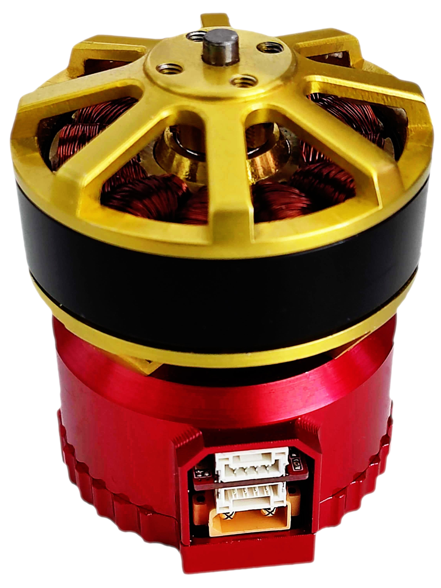
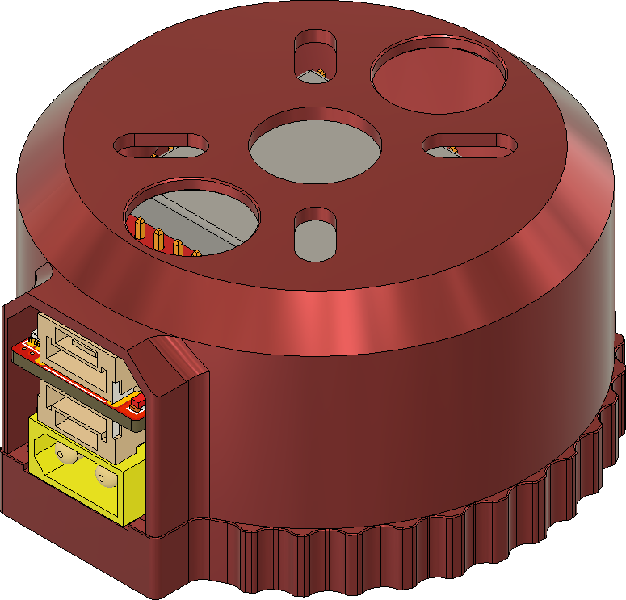

# Zubax Sadulli

Sadulli is an open-hardware reference design of a 500 W integrated propeller drive based on the
[Mitochondrik LV](http://zubax.com/mitochondrik-lv) motor control chip.
It includes a motor and its control electronics in a single compact unit.

The main design goal is to create a compact yet sophisticated motor controller that can be integrated with relatively
small BLDC and PMSM motors (about 40-45 mm in diameter) in a single unit.
Being equipped with a standard mounting hole pattern,
Sadulli can be used as a drop-in replacement for regular standalone motors in various UAV applications.

## Brief specs

- Operating voltage range: 4-8S Li-ion LiCoO2, 12-34 V
- Maximum continuous power 500 W
- [Cyphal](https://telega.zubax.com/) (formerly UAVCAN)/CAN interface compatible with the DS-015 drone standard
- Solderless integration

Sadulli consists of two main parts: a COTS motor and the ESC.
This repository contains the ESC hardware source files only.
There are two design variants of the Sadulli drive.
All of them share the same ESC design.

Variant  | Motor                 | Propeller diameter [inch] | Propeller pitch [inch] | Mass [g]
-------- | --------------------- | ------------------------- | ---------------------- | --------
Alakdan  | Scorpion MII-4010     | 17                        | 6.2                    | 193
Nudo     | N/A                   | N/A                       | N/A                    | 62

Alakdan | Nudo
--|--
 | 

Sadulli is equipped with a single non-redundant Cyphal/CAN interface.
The input power is supplied through a standard XT30 male connector.
The device can deliver 5V to the Cyphal/CAN power delivery network if the respective configuration option is enabled.

Under the hood, Sadulli represents the construction of three PCBs (excluding the Mitochondrik).

The main PCB that determines most of Sadulli's properties is the power stage PCB.
The power stage is composed of three [BUK9K6R2-40E](https://www.digikey.com/products/en?keywords=1727-7274-1-ND)
MOSFET arrays.

Parameter                                               | Value
------------------------------------------------------- | -------------------
Drain to Source Voltage (Vds)                | 40 V
Current - Continuous Drain (Id) @ 25°C       | 40 A
Rds on (Max) @ Id, Vgs | 6 mOhm @ 25 A, 10 V
Gate Charge (Qg) (Max) @ Vgs      | 35.4 nC @ 10 V

The resistance of the phase current shunts is 3 mOhm.

The bulk capacitor bank is formed with 6
[68µF aluminum electrolytic capacitors](https://www.digikey.com/product-detail/en/w-rth-elektronik/860020673014/732-8860-3-ND/5727097).

The overcurrent protection is configured to trigger at
~47 A using a 1k resistor connected to the `OC_adj` pin (R1 on the connector PCB).

## Release notes

### Sadulli v1.5 (April 2023)

* Added Alakdan variant using Scorpion MII-4010 motor.
* Removed Grosso and Piccino variants using SunnySky motors.
* Updated assembly guide.
* Added thermistor alternatives:

Original  | Alternatives
--------- | -----------------
KTY81/120 | KTY81/110, KTY81/121, KTY81/122, KTY81/150, 102PS1J, 102PS1G

### Sadulli v1.0 (January 2021)

First stable release. There have been no substantial changes compared to the pre-production revision.

## License

This project is licensed under the terms of [CC-BY 4.0](https://creativecommons.org/licenses/by/4.0/).
