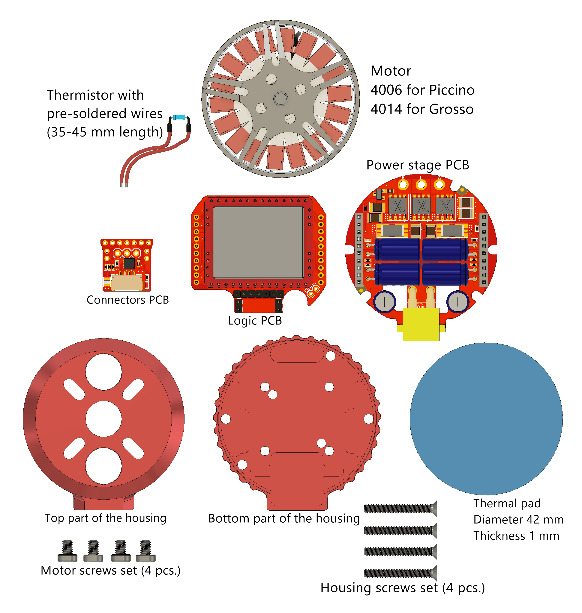

Prior to starting the assembly make sure that all the  items from the list below are present.

* Appropriate motor:
  * 4006 for Piccino
  * 4014 for Grosso

* Thermistor with pre-soldered extension wires
* A set of PCBs:
	* Connectors PCB
	* Logic PCB
	* Power stage PCB
* Housing:
  * Top part
  * Bottom part
* Thermal pad

* A set of screws for the motor

* A set of screws for the housing itself

  

Motor should be slightly modified to assemble the device: 

* Phase wires should be rerouted straight down and trimmed to ~30-40 mm (measuring from the bottom of the motor). 
* The thermistor should be glued directly to the motor windings with epoxy resin (care must be taken to avoid ingress of epoxy to the motor bearing).

Thermal pad has the shape of a circle with a diameter of 40-42 mm. Its thickness is 1 mm. [Arctic thermal pad](https://www.arctic.ac/worldwide_en/thermal-pad.html) is recommended

Motor is mounted with  4 [DIN 7984 4 mm screws](https://www.mcmaster.com/92855a301).

Housing is held together with 4 [DIN 965 20 mm screws](https://www.mcmaster.com/91420a026).

For detailed assembly process please check the video: https://youtu.be/bqTBei1wUUw

